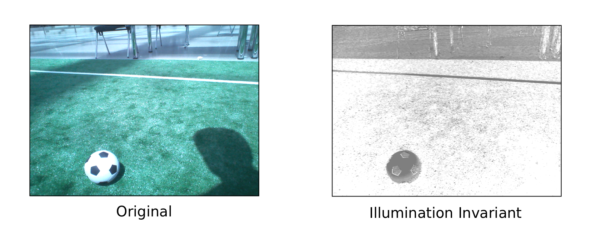

# Color-Constancy
> Illumination invariant images

This is just a quick implementation and test of a formula to obtain illumination invariant (shadowless) images based on the paper *Illumination Invariant Imaging: Applications in Robust Vision-based Localisation, Mapping and Classification for Autonomous Vehicles* by [Will Maddern et. al](http://ori.ox.ac.uk/ori-people/will-maddern/).

   
  

